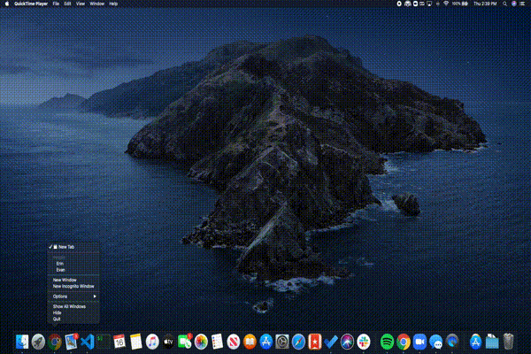
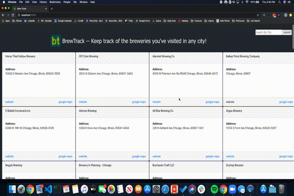
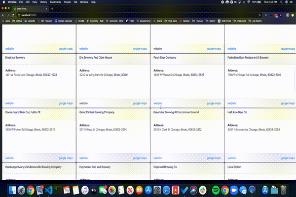

# Project Name

Brew Track

## Table of Contents

1. [Usage](#Usage)
1. [Requirements](#requirements)
1. [Demos](#demos)

## Usage

This is a one page app designed to help you keep track of the breweries you've visited in different towns and has the following features:

1. Type a city in the search bar (case insensitive) and see the breweries in that city
2. Click on a brewery to check it off your list and it will highlight in green, click again and it will revert
3. Each brewery card contains links to the brewery website and to it's location on google maps
4. Data persistence (reliant on the browser data storage):
   - Remembers which breweries you have checked off
   - Opens on default to the last city that you visited

## Demos

Demo of initial open of the page:

- Defaults to last visited city (Saint Louis in this example)
- Has previously checked off breweries already highlighted



Demo of changing cities:

- Type in a new city in the search bar and hit enter or submit to view the relevant breweries
- Also has any previously checked off breweries checked for you



Demo of using links:

- Link to brewery website
- Link to location on google maps



## Requirements

- Node 6.13.0

### Installing Dependencies

From within the root directory:

```
npm install
npm start

```
